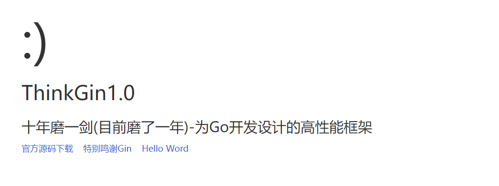
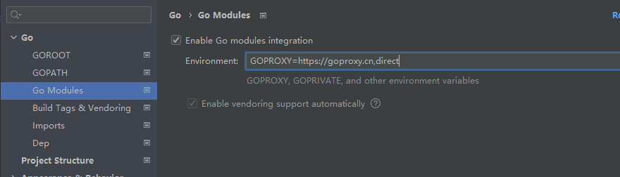

# ThinkGin




#### 介绍
实现一个Go语言基于gin的增删改查基础框架

#### 软件架构
```azure
thinkgin  应用部署目录
├─app                  应用目录（可设置）
│  ├─common            公共模块目录（可更改）
│  │  └─model          模型目录
│  └─index             模块目录(可更改)
│      ├─controller    控制器目录
│      │  └─v1         控制器版本目录
│      ├─model         模块模型目录
│      └─view          模块视图目录
├─config               公共配置文件(已删除，配置文件更新到最外层)
├─dao                  数据库基础SQL文件目录     
├─extend               扩展目录
│  ├─error             错误码目录
│  ├─setting           配置关联目录
│  └─util              常用扩展目录
├─public               WEB 部署目录（对外访问目录）
├─route                路由目录
└─runtime              应用的运行时目录（可写，可设置）
```


#### 安装教程

```azure
导入数据库：数据库文件地址：dao/thinkgin.sql
修改配置文件数据库配置：config/config.ini

C:\> $env:GO111MODULE = "on"
C:\> $env:GOPROXY = "https://goproxy.cn,direct"
或者
C:\> $env:GOPROXY = "https://goproxy.io,direct"

go mod init thinkgin
go mod tidy
go run main.go

访问：
http://127.0.0.1:8000/  就可以看到上面的欢迎界面
```

#### 使用说明

- API地址：https://console-docs.apipost.cn/cover.html?url=c242b016c3a04b86&salt=68d7302e8f7e1cb9
- 密码：892156

#### 1.0版本迭代

1. JWT的token校验
2. Log日志的接入
3. Swagger文档接入:https://www.cnblogs.com/xiaobaiskill/p/10696621.html

#### 常见问题
- goland导入包爆红的问题的解决方案（成功解决Nice）：
  `GOPROXY=https://goproxy.cn,direct`



##### 人生感悟
- 永远不要相信别人的老婆会对你产生感情，也永远不要给对方打钱，打钱也只能给现金   2022年10月26日01:28:09


