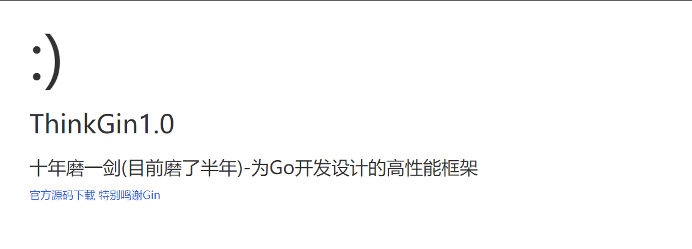

# ThinkGin2.0



#### 介绍

实现一个 Go 语言基于 gin 的增删改查基础框架

#### 软件架构

```azure
thinkgin  应用部署目录
├─app                应用目录（可设置）
├  └─index            默认模块
├   ├─controller      控制器
├   ├─model           模型
├   └─view            视图
├─extend             扩展目录
├─public             公共目录
├─route              路由
└─runtime            运行日志
```

#### Usage

Go 1.13 and above (RECOMMENDED)

Open your terminal and execute

```
$ go env -w GO111MODULE=on
$ go env -w GOPROXY=https://goproxy.cn,direct
```

done.

macOS or Linux

Open your terminal and execute

```
$ export GO111MODULE=on
$ export GOPROXY=https://goproxy.cn
```

or

```
$ echo "export GO111MODULE=on" >> ~/.profile
$ echo "export GOPROXY=https://goproxy.cn" >> ~/.profile
$ source ~/.profile
```

done.

Windows

Open your terminal and execute

```
C:\> $env:GO111MODULE = "on"
C:\> $env:GOPROXY = "https://goproxy.cn"
```

or

1. Open the Start Search, type in "env"
2. Choose the "Edit the system environment variables"
3. Click the "Environment Variables…" button
4. Under the "User variables for <YOUR_USERNAME>" section (the upper half)
5. Click the "New..." button
6. Choose the "Variable name" input bar, type in "GO111MODULE"
7. Choose the "Variable value" input bar, type in "on"
8. Click the "OK" button
9. Click the "New..." button
10. Choose the "Variable name" input bar, type in "GOPROXY"
11. Choose the "Variable value" input bar, type in "https://goproxy.cn"
12. Click the "OK" button

done.

```
go mod init thinkgin
go mod tidy
go run main.go

访问：
http://localhost:8000/  就可以看到上面的欢迎界面
```

#### 常见问题

- goland 导入包爆红的问题的解决方案（成功解决 Nice）：
  `GOPROXY=https://goproxy.cn,direct`
  

#### 路由规范

###### 路由编写文件：`route/router.go`

###### 访问示例：`http://thinkgin.cn:8000/index/hello`

```azure
{
    "code": 200,
    "data": {
        "Time": "2023-02-01T10:11:41.76127929+08:00",
        "data": "Hello ThinkGin!",
        "name": ""
    },
    "msg": "ok"
}
```

#### Linux 打包

```azure
go env -w GO111MODULE=on
go env -w GOPROXY=https://goproxy.cn,direct
go build -o thinkgin.sh
```

##### 直接运行即可：

`./thinkgin.sh`

##### 或后台执行：

`nohup ./thinkgin.sh 1>info.log 2>&1 &`
