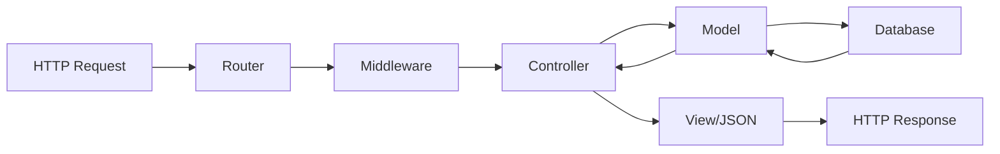

# ThinkGin 3.0

<div align="center">
**🚀 基于 Gin 的高性能 Go Web 框架**

[](https://golang.org/)
[](LICENSE)
[](https://github.com/your-repo/thinkgin/releases)

</div>

---

## 📖 目录

- [🎯 项目介绍](#-项目介绍)
- [🚀 快速开始](#-快速开始)
- [🏗️ 架构设计](#️-架构设计)
- [📁 配置管理](#-配置管理)
- [📝 日志系统](#-日志系统)
- [📊 监控体系](#-监控体系)
- [🛠️ 开发指南](#️-开发指南)
- [📦 部署指南](#-部署指南)
- [❓ 常见问题](#-常见问题)

---

## 🎯 项目介绍

ThinkGin 3.0 是一个基于 Gin 框架的现代化 Go 语言 Web 应用框架，专注于提供：

- ⚡ **高性能**: 基于 Gin 的高性能 HTTP 路由
- 🔧 **模块化**: 完全模块化的配置管理系统
- 📊 **可观测**: 日志、监控、链路追踪能力（逐步落地）
- 🛡️ **企业级**: 生产环境就绪的安全性和稳定性
- 🎨 **易用性**: 简洁优雅的 API 设计和丰富的文档

### ✨ 核心特性

| 特性            | 描述                                  |
| --------------- | ------------------------------------- |
| 🏗️ **MVC 架构** | 标准的 Model-View-Controller 架构模式 |
| ⚙️ **配置化**   | 基于 YAML 的模块化配置管理            |
| 📈 **监控集成** | 内置 Prometheus 监控和 Grafana 可视化 |
| 📝 **日志系统** | 基于 Logrus 的结构化日志记录          |
| 🔍 **链路追踪** | 支持 Jaeger、Zipkin 分布式追踪        |
| 💾 **多数据源** | 支持 MySQL、PostgreSQL、Redis 等      |
| 🌐 **国际化**   | 完整的多语言支持                      |
| 🔐 **安全性**   | JWT 认证、CORS、安全中间件            |

---

## 🏗️ 架构设计

### 📂 项目结构

```
thinkgin/                    # 项目根目录
├── 📁 app/                  # 应用层
│   ├── 📁 index/            # 模块示例
│   │   ├── 📁 controller/   # 控制器层
│   │   ├── 📁 model/        # 数据模型层
│   │   └── 📁 view/         # 视图层
│   └── 📄 config.go         # 配置管理入口
├── 📁 config/               # 配置文件目录
│   ├── 📄 app.yaml          # 应用主配置
│   ├── 📄 server.yaml       # 服务器配置
│   ├── 📄 database.yaml     # 数据库配置
│   ├── 📄 log.yaml          # 日志配置
│   ├── 📄 prometheus.yaml   # 监控配置
│   └── 📄 ...               # 其他模块配置
├── 📁 extend/               # 扩展组件
│   └── 📁 middleware/       # 中间件
├── 📁 route/                # 路由定义
├── 📁 public/               # 静态资源
├── 📁 runtime/              # 运行时文件
└── 📄 main.go               # 程序入口
```

### 🔄 请求流程



#### 🚀 快速开始

##### 📋 环境要求

- **Go 版本**: 1.18 或更高版本 (推荐 1.19+)
- **操作系统**: Windows 10+, macOS 10.14+, Linux (Ubuntu 18.04+, CentOS 7+)
- **内存**: 最低 512MB，推荐 1GB+
- **磁盘空间**: 最低 100MB

##### 🔧 环境配置

###### **方法一：现代化配置 (Go 1.18+，推荐)**

```bash
# 设置 Go 模块和代理 (全局永久配置)
go env -w GO111MODULE=on
go env -w GOPROXY=https://goproxy.cn,direct
go env -w GOSUMDB=sum.golang.google.cn

# 验证配置
go env | grep -E "(GO111MODULE|GOPROXY|GOSUMDB)"
```

###### **方法二：传统配置 (适用于较老版本)**

**macOS/Linux (Bash/Zsh)**

```bash
# 临时设置 (仅当前终端会话有效)
export GO111MODULE=on
export GOPROXY=https://goproxy.cn,direct
export GOSUMDB=sum.golang.google.cn

# 永久设置 (添加到 ~/.bashrc 或 ~/.zshrc)
echo 'export GO111MODULE=on' >> ~/.bashrc
echo 'export GOPROXY=https://goproxy.cn,direct' >> ~/.bashrc
echo 'export GOSUMDB=sum.golang.google.cn' >> ~/.bashrc
source ~/.bashrc
```

**Windows (命令提示符)**

```cmd
# 临时设置
set GO111MODULE=on
set GOPROXY=https://goproxy.cn,direct
set GOSUMDB=sum.golang.google.cn

# 永久设置 (系统环境变量)
setx GO111MODULE on
setx GOPROXY https://goproxy.cn,direct
setx GOSUMDB sum.golang.google.cn
```

**Windows (PowerShell)**

```powershell
# 临时设置
$env:GO111MODULE="on"
$env:GOPROXY="https://goproxy.cn,direct"
$env:GOSUMDB="sum.golang.google.cn"

# 永久设置 (用户环境变量)
[Environment]::SetEnvironmentVariable("GO111MODULE", "on", "User")
[Environment]::SetEnvironmentVariable("GOPROXY", "https://goproxy.cn,direct", "User")
[Environment]::SetEnvironmentVariable("GOSUMDB", "sum.golang.google.cn", "User")
```

##### 🏃‍♂️ 运行项目

###### **方法一：从源码运行 (开发推荐)**

```bash
# 1. 克隆项目 (如果还未克隆)
git clone https://github.com/your-repo/thinkgin.git
cd thinkgin

# 2. 初始化 Go 模块 (如果 go.mod 不存在)
go mod init thinkgin

# 3. 下载依赖
go mod tidy

# 4. 运行项目
go run main.go

# 5. 验证运行
curl http://localhost:8000/ || echo "请在浏览器访问 http://localhost:8000/"
```

###### **方法二：编译后运行 (生产推荐)**

```bash
# 1. 编译项目
go build -o thinkgin main.go

# 2. 运行编译后的程序
# Linux/macOS
./thinkgin

# Windows
thinkgin.exe
```

###### **方法三：Docker 运行 (容器化部署)**

```bash
# 1. 构建 Docker 镜像
docker build -t thinkgin:latest .

# 2. 运行容器
docker run -p 8000:8000 thinkgin:latest
```

##### ✅ 验证运行

成功启动后，您应该看到类似输出：

```
[GIN-debug] [WARNING] Creating an Engine instance with the Logger and Recovery middleware already attached.

[GIN-debug] [WARNING] Running in "debug" mode. Switch to "release" mode in production.
 - using env:   export GIN_MODE=release
 - using code:  gin.SetMode(gin.ReleaseMode)

[GIN-debug] GET    /                         --> thinkgin/app/index/controller.Hello (3 handlers)
[GIN-debug] GET    /index/hello              --> thinkgin/app/index/controller.Hello (3 handlers)
[GIN-debug] Listening and serving HTTP on :8000
```

**访问测试：**

- 🌐 **浏览器访问**: http://localhost:8000/
- 🔧 **API 测试**: http://localhost:8000/index/hello
- 📊 **监控端点**: http://localhost:8000/metrics (如果启用了 Prometheus)

##### ⚠️ 常见异常情况及解决方案

###### **1. Go 版本过低**

**错误信息**:

```
go: thinkgin requires go >= 1.18 (running go 1.17)
```

**解决方案**:

```bash
# 更新 Go 版本
# macOS (使用 Homebrew)
brew install go

# Ubuntu/Debian
sudo rm -rf /usr/local/go
wget https://golang.org/dl/go1.20.linux-amd64.tar.gz
sudo tar -C /usr/local -xzf go1.20.linux-amd64.tar.gz

# Windows: 下载安装包 https://golang.org/dl/
```

###### **2. 网络连接问题**

**错误信息**:

```
go: module lookup disabled by GOPROXY=off
go: downloading github.com/gin-gonic/gin: dial tcp: lookup proxy.golang.org: no such host
```

**解决方案**:

```bash
# 方案 1: 使用国内代理
go env -w GOPROXY=https://goproxy.cn,direct

# 方案 2: 使用阿里云代理
go env -w GOPROXY=https://mirrors.aliyun.com/goproxy/,direct

# 方案 3: 直连模式 (不推荐)
go env -w GOPROXY=direct
```

###### **3. 端口占用问题**

**错误信息**:

```
listen tcp :8000: bind: address already in use
```

**解决方案**:

```bash
# 方案 1: 查找并终止占用端口的进程
# Linux/macOS
lsof -ti:8000 | xargs kill -9

# Windows
netstat -ano | findstr :8000
taskkill /PID <PID> /F

# 方案 2: 修改配置文件中的端口
# 编辑 config/server.yaml，修改 port 值
```

###### **4. 权限问题**

**错误信息**:

```
permission denied: ./thinkgin
mkdir runtime: permission denied
```

**解决方案**:

```bash
# Linux/macOS
chmod +x thinkgin
sudo mkdir runtime
sudo chown $USER:$USER runtime

# Windows (以管理员身份运行 PowerShell)
```

###### **5. 模块依赖问题**

**错误信息**:

```
go: can't find module providing package github.com/gin-gonic/gin
module github.com/gin-gonic/gin: reading at revision v1.9.1: unknown revision
```

**解决方案**:

```bash
# 清理模块缓存并重新下载
go clean -modcache
go mod download
go mod tidy

# 如果仍有问题，删除 go.sum 后重试
rm go.sum
go mod tidy
```

###### **6. 配置文件问题**

**错误信息**:

```
yaml: unmarshal errors: line 2: cannot unmarshal !!str
config file not found: config/app.yaml
```

**解决方案**:

```bash
# 检查配置文件是否存在
ls -la config/

# 检查 YAML 语法
# 使用在线工具: https://yaml-online-parser.appspot.com/
# 或安装 yamllint
pip install yamllint
yamllint config/app.yaml
```

###### **7. 内存不足**

**错误信息**:

```
runtime: out of memory
signal: killed
```

**解决方案**:

```bash
# 检查系统内存
free -h  # Linux
vm_stat  # macOS

# 调整 Go 垃圾回收
export GOGC=50  # 更频繁的垃圾回收
export GOMEMLIMIT=512MB  # 限制内存使用 (Go 1.19+)
```

##### 🔍 故障排查工具

```bash
# 1. 检查 Go 环境
go version
go env

# 2. 检查网络连接
curl -I https://goproxy.cn
ping goproxy.cn

# 3. 检查端口状态
netstat -tlnp | grep :8000  # Linux
netstat -an | findstr :8000  # Windows

# 4. 查看详细错误日志
go run main.go -v  # 详细模式
tail -f runtime/log/system.log  # 查看运行日志
```

##### 📞 获取帮助

如果遇到其他问题，请按以下步骤排查：

1. **查看日志**: 检查 `runtime/log/` 目录下的日志文件
2. **检查配置**: 确保 `config/` 目录下所有 YAML 文件语法正确
3. **环境检查**: 运行 `go env` 检查 Go 环境配置
4. **提交 Issue**: 在 GitHub 仓库提交详细的错误信息和环境描述

---

## 📁 配置管理

ThinkGin 3.0 采用**模块化配置架构**，将不同功能的配置分离到独立文件中：

### 🎛️ 配置架构

| 配置文件          | 功能         | 重要性 |
| ----------------- | ------------ | ------ |
| `app.yaml`        | 应用基础配置 | ⭐⭐⭐ |
| `server.yaml`     | 服务器配置   | ⭐⭐⭐ |
| `database.yaml`   | 数据库配置   | ⭐⭐⭐ |
| `log.yaml`        | 日志配置     | ⭐⭐   |
| `prometheus.yaml` | 监控配置     | ⭐⭐   |
| `cache.yaml`      | 缓存配置     | ⭐     |
| `session.yaml`    | 会话配置     | ⭐     |

### 💻 使用示例

```go
// 获取配置实例
config := app.GetConfig()

// 访问不同模块配置
appName := config.App.Name
serverPort := config.Server.HTTP.Port
dbConfig := config.Database.Default
```

<details>
<summary><strong>📄 配置文件示例</strong></summary>

**app.yaml**

```yaml
app:
  name: "ThinkGin"
  version: "2.0.1"
  debug: true
  timezone: "Asia/Shanghai"
  jwt:
    secret: "your-secret-key"
    expire: 7200
```

**server.yaml**

```yaml
server:
  http:
    host: "0.0.0.0"
    port: 8000
    read_timeout: 60
    write_timeout: 60
  mode: "debug"
```

</details>

---

## 📝 日志系统

基于 **Logrus** 的高性能结构化日志系统，GitHub 25k+ Stars。

### ✨ 核心特性

- 🚀 **高性能**: 异步日志写入，零阻塞
- 📊 **结构化**: JSON/Text 双格式支持
- 🔄 **自动轮转**: 按时间/大小自动切割
- 📝 **多级别**: 7 个日志级别精准控制
- 🎯 **业务友好**: 简洁的业务日志 API

### 📊 日志级别

| 级别    | 使用场景 | 示例             |
| ------- | -------- | ---------------- |
| `trace` | 详细跟踪 | 函数进入/退出    |
| `debug` | 调试信息 | 变量值、流程状态 |
| `info`  | 一般信息 | 业务流程记录     |
| `warn`  | 警告信息 | 潜在问题提醒     |
| `error` | 错误信息 | 异常处理         |
| `fatal` | 致命错误 | 程序无法继续     |
| `panic` | 恐慌级别 | 触发 panic       |

### 💻 使用方法

```go
import "thinkgin/extend/middleware"

// 记录信息日志
middleware.BusinessLogger("info", "用户登录成功", map[string]interface{}{
    "user_id": 123,
    "username": "john",
    "ip": "192.168.1.1",
})

// 记录错误日志
middleware.BusinessLogger("error", "数据库连接失败", map[string]interface{}{
    "error": err.Error(),
    "database": "mysql",
})

// 记录调试日志
middleware.BusinessLogger("debug", "处理业务逻辑", map[string]interface{}{
    "step": "validation",
    "data": requestData,
})
```

**3. 获取日志实例**

如需更复杂的日志操作，可直接获取 logrus 实例：

```go
import "thinkgin/app"

logger := app.GetLogger()
logger.WithFields(logrus.Fields{
    "user_id": 123,
    "action": "update_profile",
}).Info("用户更新资料")
```

##### 日志文件

- 日志文件位置：`runtime/log/`
- 文件命名：`system.YYYYMMDD.log`
- 当前日志软链：`system.log`
- 自动清理：超过设定天数的旧日志会自动删除

##### 日志级别说明

| 级别  | 说明             | 使用场景         |
| ----- | ---------------- | ---------------- |
| trace | 最详细的跟踪信息 | 调试复杂问题时   |
| debug | 调试信息         | 开发调试         |
| info  | 一般信息         | 业务流程记录     |
| warn  | 警告信息         | 潜在问题提醒     |
| error | 错误信息         | 错误处理         |
| fatal | 致命错误         | 程序无法继续运行 |
| panic | 恐慌级错误       | 触发 panic       |

##### 示例配置

**开发环境配置** (`config/log.yaml`)

```yaml
log:
  default:
    level: "debug"
    format: "text"
  file:
    max_age: 3
    rotation_time: 6
```

**生产环境配置** (`config/log.yaml`)

```yaml
log:
  default:
    level: "info"
    format: "json"
  file:
    max_age: 30
    rotation_time: 24
```

#### 📊 Prometheus 监控

ThinkGin 3.0 集成了 **Prometheus** 监控服务，提供完整的应用性能监控和业务指标采集功能。

3.0 版本对 Prometheus 指标做了改进：

- **scope 标签**：区分 `api/web/static/metrics`
- **route 标签**：可按配置决定是否使用 Gin 的路由模板（避免 label 爆炸）

##### 🎯 监控特性

- 🚀 **HTTP 请求监控**: 自动记录请求数量、响应时间、请求大小、响应大小
- 💾 **系统资源监控**: 实时监控 CPU 使用率、内存使用量、进程信息
- 🔧 **业务指标支持**: 提供计数器、直方图、仪表盘三种业务指标类型
- ⚙️ **配置化管理**: 所有监控参数都可通过配置文件调整
- 🔐 **安全认证**: 支持基础认证保护监控端点
- 🏷️ **自定义标签**: 支持自定义标签和命名空间

##### ⚡ 快速开始

1. **配置总开关**（`config/app.yaml`）

   ```yaml
   app:
     monitoring:
       prometheus_enabled: true # 开启监控
   ```

2. **启动应用**

   ```bash
   go run main.go
   ```

3. **查看监控数据**
   ```bash
   curl http://localhost:8000/metrics
   ```

##### ❤️ k8s 探针

- `GET /livez`
- `GET /readyz`

##### ⚙️ 配置说明

**总开关配置**

首先在 `config/app.yaml` 文件中控制监控功能的总开关：

```yaml
app:
  # 监控配置
  monitoring:
    # 普罗米修斯监控总开关
    prometheus_enabled: true
```

**详细配置**

然后在 `config/prometheus.yaml` 文件中配置具体的监控参数：

```yaml
prometheus:
  # 是否启用 Prometheus 监控
  enabled: true

  # 监控指标暴露路径
  path: "/metrics"

  # 监控端口（0表示使用主服务端口）
  port: 0

  # 监控服务名称
  service_name: "thinkgin"

  # 监控命名空间
  namespace: "app"

  # 自定义标签
  labels:
    environment: "development"
    version: "3.0"

  # 监控指标配置
  metrics:
    # HTTP请求相关指标
    http:
      enabled: true
      requests_total: "http_requests_total"
      request_duration: "http_request_duration_seconds"
      request_size: "http_request_size_bytes"
      response_size: "http_response_size_bytes"
      include_path: false # 是否包含URL路径标签

    # 系统资源指标
    system:
      enabled: true
      cpu_usage: "system_cpu_usage_percent"
      memory_usage: "system_memory_usage_bytes"
      process_start_time: "process_start_time_seconds"

    # 业务指标
    business:
      enabled: true
      counter_prefix: "business_counter"
      histogram_prefix: "business_histogram"
      gauge_prefix: "business_gauge"

  # 监控数据采集间隔（秒）
  scrape_interval: 15

  # 是否启用基础认证
  auth:
    enabled: false
    username: "prometheus"
    password: "secure_password"
```

**配置优先级说明**

监控功能需要同时满足以下条件才会启用：

1. `app.yaml` 中的 `monitoring.prometheus_enabled` 必须为 `true`（总开关）
2. `prometheus.yaml` 中的 `prometheus.enabled` 必须为 `true`（具体功能开关）

这种设计允许您在不删除具体配置的情况下，通过总开关快速禁用整个监控功能。

##### 🔧 基础使用

**1. 访问监控端点**

启动应用后，访问监控指标端点：

```bash
curl http://localhost:8000/metrics
```

**2. 在业务代码中使用监控**

```go
package controller

import (
    "time"
    "thinkgin/extend/middleware"
    "github.com/gin-gonic/gin"
)

func YourHandler(c *gin.Context) {
    start := time.Now()

    // 记录 API 调用次数
    if counter := middleware.BusinessCounter("api_calls", []string{"endpoint", "status"}); counter != nil {
        counter.WithLabelValues("/api/users", "success").Inc()
    }

    // 记录 API 响应时间
    if histogram := middleware.BusinessHistogram("api_duration", []string{"endpoint"}, nil); histogram != nil {
        histogram.WithLabelValues("/api/users").Observe(time.Since(start).Seconds())
    }

    // 记录在线用户数
    if gauge := middleware.BusinessGauge("online_users", []string{"type"}); gauge != nil {
        gauge.WithLabelValues("active").Set(123)
    }

    // ... 业务逻辑
}
```

**3. 可用的业务指标类型**

- **Counter (计数器)**: 只能递增的累计指标，如请求总数、错误总数
- **Histogram (直方图)**: 观察值的分布，如响应时间、请求大小
- **Gauge (仪表盘)**: 可增可减的即时值，如当前连接数、内存使用量

##### 📈 Prometheus 服务器配置

创建 `prometheus.yml` 配置文件：

```yaml
global:
  scrape_interval: 15s

scrape_configs:
  - job_name: "thinkgin"
    static_configs:
      - targets: ["localhost:8000"]
    metrics_path: "/metrics"
    scrape_interval: 15s
```

##### 🚀 启动 Prometheus

```bash
# 下载 Prometheus
wget https://github.com/prometheus/prometheus/releases/download/v2.45.0/prometheus-2.45.0.linux-amd64.tar.gz
tar xvfz prometheus-*.tar.gz
cd prometheus-*

# 启动 Prometheus
./prometheus --config.file=prometheus.yml
```

访问 Prometheus Web UI: http://localhost:9090

##### 📊 常用监控查询

```promql
# HTTP 请求总数
app_http_requests_total

# 平均响应时间
rate(app_http_request_duration_seconds_sum[5m]) / rate(app_http_request_duration_seconds_count[5m])

# 错误率 (5xx 错误)
rate(app_http_requests_total{status=~"5.."}[5m]) / rate(app_http_requests_total[5m])

# 内存使用量
app_system_memory_usage_bytes

# 业务 API 调用频率
rate(app_business_counter_api_calls[5m])
```

##### 🔐 安全配置

**启用认证：**

```yaml
prometheus:
  auth:
    enabled: true
    username: "monitor"
    password: "your_secure_password"
```

**访问受保护的端点：**

```bash
curl -u monitor:your_secure_password http://localhost:8000/metrics
```

##### 📚 集成 Grafana

1. 安装 Grafana
2. 添加 Prometheus 数据源：`http://localhost:9090`
3. 导入预置仪表板或创建自定义仪表板
4. 创建告警规则监控关键指标

### 🗄️ 其他配置模块

- **🗄️ 数据库配置** (`config/database.yaml`): 支持 MySQL、PostgreSQL、SQLite、Redis
- **🚀 缓存配置** (`config/cache.yaml`): 支持 Redis、内存、文件缓存
- **🔐 会话配置** (`config/session.yaml`): 支持文件、Redis、数据库存储
- **🛡️ 中间件配置** (`config/middleware.yaml`): 全局中间件和路由组中间件
- **🎨 视图配置** (`config/view.yaml`): 模板引擎和静态资源配置
- **📁 文件系统配置** (`config/filesystem.yaml`): 本地存储和云存储(阿里云 OSS、腾讯云 COS、七牛云)
- **🌐 多语言配置** (`config/lang.yaml`): 国际化支持
- **🔍 链路追踪配置** (`config/trace.yaml`): Jaeger、Zipkin、OpenTelemetry 支持

通过这个完整的模块化配置系统，你可以轻松管理应用程序的各个方面，实现配置的分离和模块化管理。

---

## 🛠️ 开发指南

### 🛣️ 路由规范

**路由文件**: `route/router.go`

```go
// 示例路由定义
func SetupRoutes(r *gin.Engine) {
    api := r.Group("/api/v1")
    {
        api.GET("/users", controller.GetUsers)
        api.POST("/users", controller.CreateUser)
        api.PUT("/users/:id", controller.UpdateUser)
        api.DELETE("/users/:id", controller.DeleteUser)
    }
}
```

**访问示例**:

- API: `http://localhost:8000/index/hello`
- 响应格式:

```json
{
  "code": 200,
  "data": {
    "Time": "2023-02-01T10:11:41.761Z",
    "data": "Hello ThinkGin!",
    "name": ""
  },
  "msg": "ok"
}
```

### 🎨 开发最佳实践

- 📁 **目录规范**: 按模块组织代码结构
- 🔧 **配置驱动**: 所有环境变量通过配置文件管理
- 📝 **日志规范**: 使用结构化日志记录关键信息
- 🧪 **测试覆盖**: 编写单元测试和集成测试
- 📊 **监控埋点**: 在关键业务流程添加监控指标

---

## 📦 部署指南

### 🐳 Docker 部署 (推荐)

```dockerfile
FROM golang:1.20-alpine AS builder
WORKDIR /app
COPY . .
RUN go mod tidy && go build -o thinkgin

FROM alpine:latest
RUN apk --no-cache add ca-certificates
WORKDIR /root/
COPY --from=builder /app/thinkgin .
COPY --from=builder /app/config ./config
CMD ["./thinkgin"]
```

```bash
# 构建和运行
docker build -t thinkgin:v3.0 .
docker run -p 8000:8000 thinkgin:v3.0
```

### 🏗️ 编译部署

<details>
<summary><strong>🖥️ 不同平台编译</strong></summary>

**本地编译**

```bash
go build -o thinkgin main.go
```

**跨平台编译**

```bash
# Linux
GOOS=linux GOARCH=amd64 go build -o thinkgin-linux
# Windows
GOOS=windows GOARCH=amd64 go build -o thinkgin.exe
# macOS
GOOS=darwin GOARCH=amd64 go build -o thinkgin-macos
```

**后台运行**

```bash
# Linux 后台运行
nohup ./thinkgin 1>info.log 2>&1 &

# 使用 systemd 管理
sudo systemctl enable thinkgin
sudo systemctl start thinkgin
```

</details>

### 📝 重要说明

> **为什么删除了 thinkgin.exe？**
>
> 1. **版本控制最佳实践**: 不提交编译后的二进制文件到 Git 仓库
> 2. **仓库体积控制**: 避免仓库变得臃肿（单个可执行文件约 20MB）
> 3. **跨平台兼容性**: 不同操作系统需要不同的可执行文件
> 4. **安全考虑**: 避免潜在的安全风险
>
> **如何重新生成可执行文件？**
>
> 只需运行对应平台的编译命令即可重新生成，编译过程通常只需几秒钟。

---

## ❓ 常见问题

### 🚨 异常处理

<details>
<summary><strong>⚠️ 常见错误及解决方案</strong></summary>

#### 1. Go 版本过低

```bash
# 错误: go: thinkgin requires go >= 1.18
# 解决: 升级 Go 版本
brew install go  # macOS
# 或下载最新版本: https://golang.org/dl/
```

#### 2. 端口占用

```bash
# 错误: listen tcp :8000: bind: address already in use
# 解决:
lsof -ti:8000 | xargs kill -9  # Linux/macOS
netstat -ano | findstr :8000   # Windows
```

#### 3. 网络连接问题

```bash
# 错误: dial tcp: lookup proxy.golang.org: no such host
# 解决: 配置国内代理
go env -w GOPROXY=https://goproxy.cn,direct
```

#### 4. 模块依赖问题

```bash
# 清理并重新下载依赖
go clean -modcache
go mod download
go mod tidy
```

#### 5. 权限问题

```bash
# Linux/macOS
chmod +x thinkgin
sudo mkdir runtime
sudo chown $USER:$USER runtime
```

#### 6. 配置文件问题

```bash
# 检查配置文件是否存在
ls -la config/

# 检查 YAML 语法
pip install yamllint
yamllint config/app.yaml
```

#### 7. 内存不足

```bash
# 检查系统内存
free -h  # Linux
vm_stat  # macOS

# 调整 Go 垃圾回收
export GOGC=50  # 更频繁的垃圾回收
export GOMEMLIMIT=512MB  # 限制内存使用 (Go 1.19+)
```

</details>

### 🔍 故障排查

```bash
# 环境检查
go version && go env

# 网络测试
curl -I https://goproxy.cn

# 端口检查
netstat -tlnp | grep :8000

# 日志查看
tail -f runtime/log/system.log
```

### 📞 获取帮助

遇到问题时，请按顺序检查：

1. **📋 检查日志**: `runtime/log/` 目录下的错误信息
2. **⚙️ 验证配置**: 确保 `config/` 目录下 YAML 文件语法正确
3. **🔧 环境诊断**: 运行 `go env` 检查环境配置
4. **🐛 提交 Issue**: 在 GitHub 提供详细的错误信息

---

## 🤝 贡献指南

欢迎贡献代码！请阅读 [CONTRIBUTING.md](CONTRIBUTING.md) 了解详细流程。

## 📄 许可证

本项目采用 [MIT](LICENSE) 许可证。

---

<div align="center">

**⭐ 如果这个项目对您有帮助，请给个 Star ⭐**

[🏠 主页](https://github.com/your-repo/thinkgin) ·
[📚 文档](https://docs.thinkgin.com) ·
[🐛 报告问题](https://github.com/your-repo/thinkgin/issues) ·
[💡 功能建议](https://github.com/your-repo/thinkgin/discussions)

</div>
